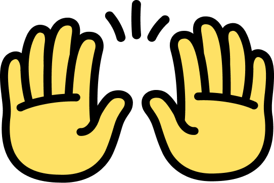

# OpenHands: Code Less, Make More

## References
- [All Hands AI - OpenHands](https://github.com/All-Hands-AI/OpenHands)

## Installation (Docker on Linux)

## Add Environment Variables
```bash
export SANDBOX_USER_ID=$(id -u)
export WORKSPACE_BASE=/path/to/your/workspace
```

### Docker Compose File
```yaml
services:
  openhands-app:
    image: docker.all-hands.dev/all-hands-ai/openhands:0.19
    container_name: openhands-app
    environment:
      - SANDBOX_RUNTIME_CONTAINER_IMAGE=docker.all-hands.dev/all-hands-ai/runtime:0.19-nikolaik
      - LOG_ALL_EVENTS=true
      - SANDBOX_USER_ID=${SANDBOX_USER_ID:-1000} # Default to 1000 if not set
      - WORKSPACE_MOUNT_PATH=${WORKSPACE_BASE:-/opt/workspace_base}
    volumes:
      - /var/run/docker.sock:/var/run/docker.sock
      - ~/.openhands-state:/.openhands-state
      - ${WORKSPACE_BASE:-/opt/workspace_base}:/opt/workspace_base
    ports:
      - "3000:3000"
    extra_hosts:
      - "host.docker.internal:host-gateway"
    restart: unless-stopped
```

### Docker Build & Run
```bash
docker compose build --no-cache
docker compose up -d
```


## Configuration File
```bash
~/.openhands-state/settings.json
```